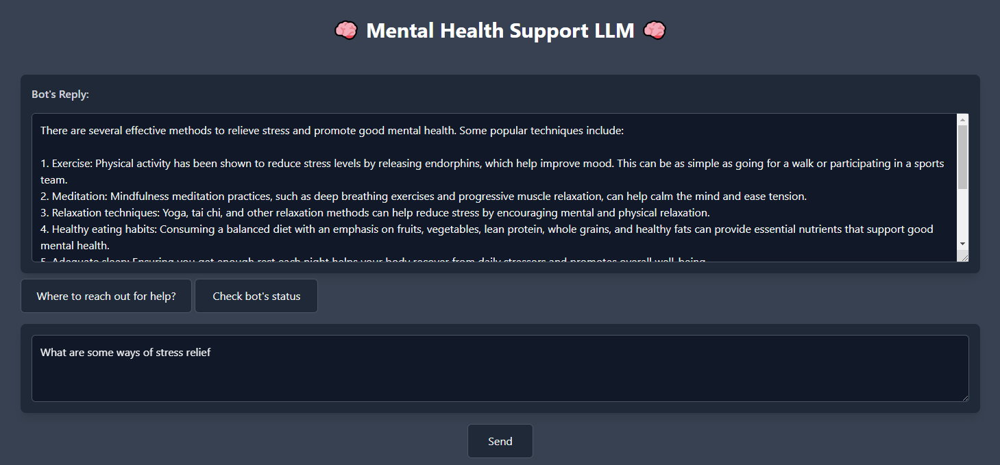

# Mental Health Chatbot

This project is a mental health chatbot designed to provide support and guidance using state-of-the-art language models (LLMs). It leverages a combination of powerful libraries and frameworks to deliver a responsive, secure, and user-friendly experience.

## Key technologies include

- SvelteKit: Powering the frontend for an intuitive, fast, and responsive user interface.
- Flask: Serving as the backend, managing requests and data flow.
- Ollama: Running the LLM locally, ensuring privacy and speed for real-time interactions.
- LangChain: Used to integrate the Ollama LLM and manage prompt templates with the OllamaLLM and ChatPromptTemplate modules.
- LLM-Guard: Providing additional safety measures to monitor and control LLM behavior, ensuring ethical and secure responses.

This combination of tools ensures that the chatbot is both scalable and safe for users seeking mental health support.

## Prerequisites for running the backend

### Download and Install Ollama

Please make sure you download Ollama from [here](https://ollama.com/download).

Once you have installed Ollama, make sure it is running and go to Command Prompt and install the LLM using the command below.

```
ollama pull dolphin-phi
```

### Create a python virtual environment and install the packages needed

```
python -m venv venv
venv\Scripts\activate
pip install -r requirements.txt
```

### To activate the virtual environment

```
venv\Scripts\activate
```

### Run the flask server

```
flask run
```

## Prerequisites for running the frontend

To run the frontend you just need to enter the commands below into your terminal. Here I am assuming you are using the terminal in VSCode.

### Change working directory into the frontend directory

```
cd .\frontend\
```

### Install dependencies

```
npm install
```

### Run the frontend

```
npm run dev
```

## Talking more about the LLM chose (dolphin-phi)

In this project, we are utilizing dolphin-phi, an uncensored language model (LLM). The rationale for selecting this LLM is to demonstrate the effectiveness of LLM-Guard, which ensures the chatbot's output adheres to strict content guidelines. By using an uncensored LLM like dolphin-phi, we can test and validate the capabilities of LLM-Guard in real-time. This allows us to detect and mitigate potentially harmful or inappropriate content, ensuring the chatbot remains safe and aligned with ethical standards, even when using an unrestricted LLM.

## Talking more about the LLM-Guard configurations

In our project, we utilize LLM-Guard to enhance the safety and appropriateness of interactions with the Dolphin-Phi model. LLM-Guard helps filter inputs and outputs based on specific criteria, ensuring that sensitive topics are handled carefully.

### Input Scanners

Our input scanners include several mechanisms designed to identify and manage potentially harmful or inappropriate content:

- Toxicity: Detects toxic language to prevent negative interactions.
- Prompt Injection: Protects against attempts to manipulate the model through crafted inputs.
- Token Limit: Ensures that user inputs do not exceed a predefined length, with a limit set to 1024 tokens.
- Language: Verifies that the input is in English, using a full match type to ensure compliance.
- BanTopics: This is a key feature in our configuration. We have separate BanTopics scanners for various sensitive topics, each with its own threshold:
  - Suicide: Set to a threshold of 0.5.
  - Violence: Set to a threshold of 0.6.
  - Bullying: Also set to a threshold of 0.6.

This separation allows for a more nuanced approach to content moderation, enabling us to apply different sensitivity levels based on the nature of the topic.

### Output Scanners

For output filtering, we employ the following scanners:

- LanguageSame: Ensures that the output is in English.
- Relevance: Assesses the relevance of the model's response to the user’s input.
- Sensitive: Checks for potentially sensitive content that should be flagged or moderated.
